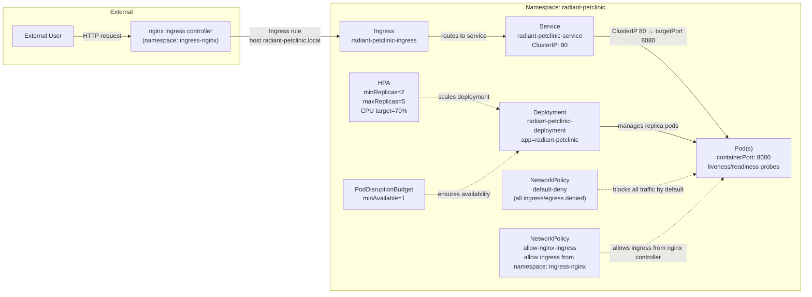

# Dependency Summary

## Application Dependencies

# Dependency Summary

| Dependency Type    | Dependency                        | Purpose                                 | Criticality |
| ------------------ | --------------------------------- | --------------------------------------- | ----------- |
| Ingress            | NGINX Ingress Controller          | Routes external traffic to application  | High        |
| Service-to-Service | Kubernetes Service                | Routes traffic to application pods      | High        |
| Database           | None                              | No external database configured         | Low         |
| Message Queue      | None                              | No message queue configured             | Low         |
| Filesystem         | None                              | No shared filesystem configured         | Low         |
| External API       | None                              | No external API integrations configured | Low         |
| Secrets            | Kubernetes Secrets (Future Scope) | Production secret management            | Medium      |
| Platform           | Kubernetes (k3d)              | Container orchestration                 | High        |
| Platform           | Docker                            | Container runtime                       | High        |
| DNS                | Local Hosts File Mapping          | Resolves radiant-petclinic.local        | Medium      |

---

# OnPrem Architecture Diagram

                        Internet / Browser
                                 |
                                 v
                  +-----------------------------+
                  |     NGINX Ingress Controller |
                  |   Host: radiant-petclinic.local
                  +-----------------------------+
                                 |
                                 v
                  +-----------------------------+
                  |   Kubernetes Service         |
                  | radiant-petclinic-service    |
                  |         ClusterIP            |
                  +-----------------------------+
                                 |
                 ---------------------------------
                 |               |               |
                 v               v               v
        +---------------+ +---------------+ +---------------+
        | PetClinic Pod | | PetClinic Pod | | PetClinic Pod |
        |   SpringBoot  | |   SpringBoot  | |   SpringBoot  |
        |     :8080     | |     :8080     | |     :8080     |
        +---------------+ +---------------+ +---------------+

## Future Production Dependencies

| Dependency | Purpose |
|---|---|
| Azure Kubernetes Service (AKS) | Production orchestration |
| Azure Container Registry (ACR) | Image storage |
| Azure Monitor | Logging and monitoring |
| MySQL Database | Persistent backend storage |
| Azure Key Vault | Secrets management |

---

## Risk Notes

- Ingress routing depends on proper DNS resolution.
- Network policies may block ingress traffic if misconfigured.
- HPA scaling depends on metrics-server availability.
- Application currently uses local container images in k3d environment.