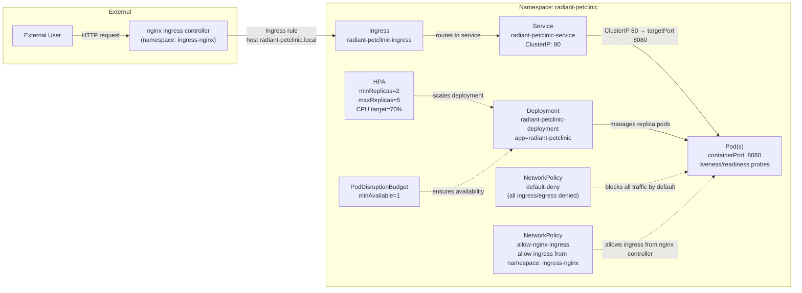
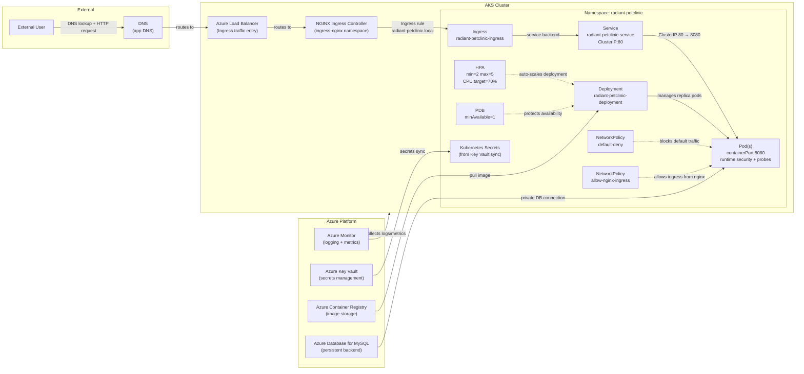

# OnPrem Architecture Diagram

```mermaid
graph LR
  subgraph External
    User["External User"]
    NGINX["nginx ingress controller\n(namespace: ingress-nginx)"]
  end

  subgraph AppNamespace["Namespace: radiant-petclinic"]
    Ingress["Ingress\nradiant-petclinic-ingress"]
    Service["Service\nradiant-petclinic-service\nClusterIP: 80"]
    Deployment["Deployment\nradiant-petclinic-deployment\napp=radiant-petclinic"]
    Pod["Pod(s)\ncontainerPort: 8080\nliveness/readiness probes"]
    HPA["HPA\nminReplicas=2\nmaxReplicas=5\nCPU target=70%"]
    PDB["PodDisruptionBudget\nminAvailable=1"]
    NPDefault["NetworkPolicy\ndefault-deny\n(all ingress/egress denied)"]
    NPAllow["NetworkPolicy\nallow-nginx-ingress\nallow ingress from namespace: ingress-nginx"]
  end

  User -->|HTTP request| NGINX
  NGINX -->|Ingress rule\nhost radiant-petclinic.local| Ingress
  Ingress -->|routes to service| Service
  Service -->|ClusterIP 80 → targetPort 8080| Pod
  Deployment -->|manages replica pods| Pod
  HPA -.->|scales deployment| Deployment
  PDB -.->|ensures availability| Deployment
  NPDefault -.->|blocks all traffic by default| Pod
  NPAllow -.->|allows ingress from nginx controller| Pod

```
# AKS Architecture Diagram

```mermaid
graph LR
  subgraph External
    User["External User"]
    DNS["DNS\n(app DNS)"]
  end

  subgraph Azure["Azure Platform"]
    ACR["Azure Container Registry\n(image storage)"]
    Monitor["Azure Monitor\n(logging + metrics)"]
    KeyVault["Azure Key Vault\n(secrets management)"]
    MySQLDB["Azure Database for MySQL\n(persistent backend)"]
  end

  subgraph AKS["AKS Cluster"]
    LB["Azure Load Balancer\n(Ingress traffic entry)"]
    NGINX["NGINX Ingress Controller\n(ingress-nginx namespace)"]

    subgraph AppNS["Namespace: radiant-petclinic"]
      Ingress["Ingress\nradiant-petclinic-ingress"]
      Service["Service\nradiant-petclinic-service\nClusterIP:80"]
      Deployment["Deployment\nradiant-petclinic-deployment"]
      Pods["Pod(s)\ncontainerPort:8080\nruntime security + probes"]
      HPA["HPA\nmin=2 max=5\nCPU target=70%"]
      PDB["PDB\nminAvailable=1"]
      NPDefault["NetworkPolicy\ndefault-deny"]
      NPAllow["NetworkPolicy\nallow-nginx-ingress"]
      SecretMounts["Kubernetes Secrets\n(from Key Vault sync)"]
    end
  end

  User -->|DNS lookup + HTTP request| DNS
  DNS -->|routes to| LB
  LB -->|routes to| NGINX
  NGINX -->|Ingress rule\nradiant-petclinic.local| Ingress
  Ingress -->|service backend| Service
  Service -->|ClusterIP 80 → 8080| Pods
  Deployment -->|manages replica pods| Pods
  HPA -.->|auto-scales deployment| Deployment
  PDB -.->|protects availability| Deployment
  NPDefault -.->|blocks default traffic| Pods
  NPAllow -.->|allows ingress from nginx| Pods
  ACR -->|pull image| Deployment
  KeyVault -->|secrets sync| SecretMounts
  MySQLDB -->|private DB connection| Pods
  Monitor -->|collects logs/metrics| AKS
```
