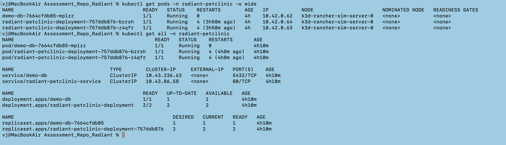
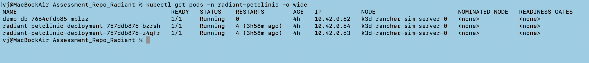
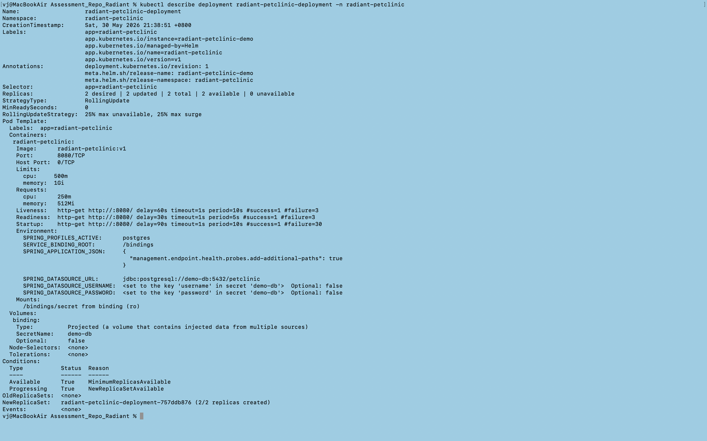
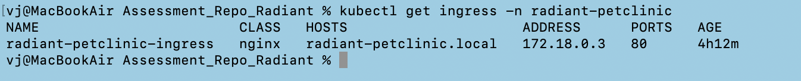
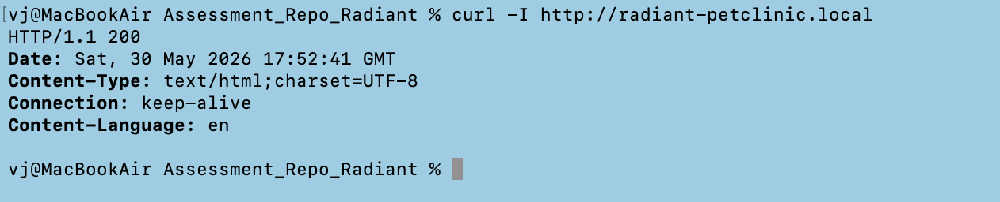
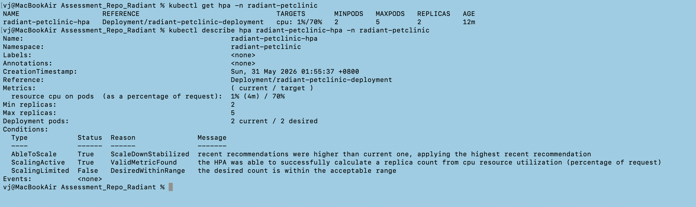
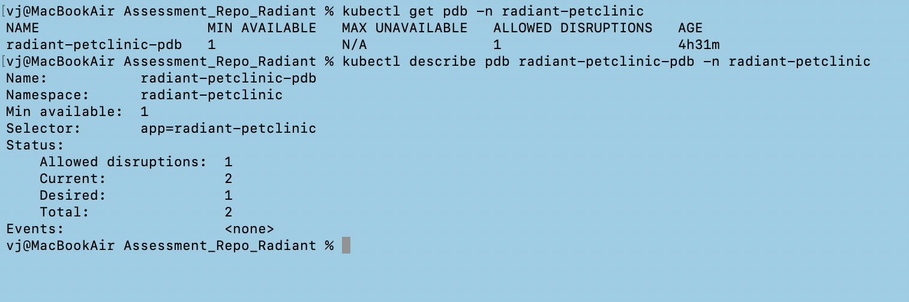

## Step 1 - Kubernetes Workload Health

##### ----> kubectl get all -n radiant-petclinic

#### ----> kubectl get pods -n radiant-petclinic -o wide

#### ----> kubectl describe deployment radiant-petclinic-deployment -n radiant-petclinic

## Step 2 - Ingress Validation

#### ----> kubectl get ingress -n radiant-petclinic

#### ----> curl -I http://radiant-petclinic.local

#### Evidence:

- Ingress exists
- HTTP 200 response
- Application accessible

## Step 3 - HPA Validation

#### ----> kubectl get hpa -n radiant-petclinic
#### ----> kubectl describe hpa radiant-petclinic-hpa -n radiant-petclinic

## Step 4 - PDB Validation

#### ----> kubectl get pdb -n radiant-petclinic
#### ----> kubectl describe pdb radiant-petclinic-pdb -n radiant-petclinic

